<div align="center">

# 🌉 FINBRIDGE
### AI-Powered Inclusive Micro-Lending & Financial Intelligence Platform

[](https://github.com/)
[](https://github.com/)
[](https://fastapi.tiangolo.com)
[](https://react.dev)
[](https://python.org)
[](LICENSE)

**Replacing Physical Collateral with Mathematical Trust for India's 63 Million MSMEs.**

[⚡ Quickstart](#-quickstart--local-setup) • [📸 Product Screenshots](#-product-walkthrough--screenshots) • [🧠 Algorithmic Core](#-algorithmic-engines--mathematical-models) • [🗺️ System Architecture](#-system-architecture) • [📄 Full Demo Script](script.md)

</div>

---

## 📌 Executive Summary

In India, **63.4 million Micro, Small, and Medium Enterprises (MSMEs)** generate nearly 30% of the nation's GDP and employ over 110 million citizens. Yet, **more than 85% of them are completely excluded from the formal banking sector**.

Traditional commercial banks rely on **CIBIL credit bureau scores**, multi-year audited balance sheets, and physical collateral (land titles, gold, fixed deposits). Micro-merchants, local retailers, and service providers operate on **live digital cash-flows** (UPI QR payments, weekly vendor cycles) without formal commercial credit histories.

$$\text{No Credit History} \longrightarrow \text{No CIBIL Score} \longrightarrow \text{Bank Rejection} \longrightarrow \text{Informal Moneylenders (36\%--120\% APR)} \longrightarrow \text{Debt Spiral}$$

### 💡 The Solution: FINBRIDGE
**FINBRIDGE replaces physical collateral with Mathematical Trust.**  
By ingesting the merchant's live digital financial exhaust—daily UPI transaction cadence, cash-flow volatility, revenue momentum, and expense discipline—FINBRIDGE calculates an **Alternative Trust Score (300 to 850)**, executes **automated micro-loan underwriting within 60 seconds**, cross-matches **subsidized government schemes** (MUDRA, CGTMSE, PMEGP), and deploys a **bilingual AI Financial Copilot** grounded in real-time telemetry.

---

## 🧩 5-in-1 Unified Problem Statement Mapping

FinBridge uniquely integrates five core fintech disciplines into a single, cohesive modular operating system:

| Module | Name | Problem Statement | FinBridge Implementation |
| :---: | :--- | :--- | :--- |
| **FT-03** | **Secure Micro-Lending** | *Core Engine* | Alternative Credit Scoring (300–850), automated DSCR/FOIR underwriting, risk-adjusted interest rates (11.5%–18%), and instant digital sanction generation. |
| **FT-05** | **Financial Analytics** | *Telemetry & Intelligence* | Working capital ratios, 90-day cash flow predictive forecasting, expense categorization, and revenue consistency indexing. |
| **FT-02** | **Fraud & Risk Surveillance** | *Security Layer* | Isolation Forest anomaly detection, $Z$-score velocity spike checks, and directed graph cycle detection for circular transactions. |
| **FT-04** | **Government Scheme Discovery** | *Opportunity Engine* | Multi-parameter fuzzy matching across official MSME schemes (PMMY MUDRA, CGTMSE ₹5 Cr guarantee, PMEGP 35% capital grant). |
| **FT-01** | **Financial Literacy & Coaching** | *Advisory Layer* | Bilingual AI Financial Copilot (English & Hindi) with dynamic telemetry prompt injection to explain cash health, loan burden, and subsidy claims. |

---

## 📸 Product Walkthrough & Screenshots
### 1. Landing Page — Macro Credit Crisis & Value Proposition
*Modern, high-conversion landing page presenting the CIBIL blindspot, core features, interactive trust-score teaser, and instant access to the demo sandbox.*
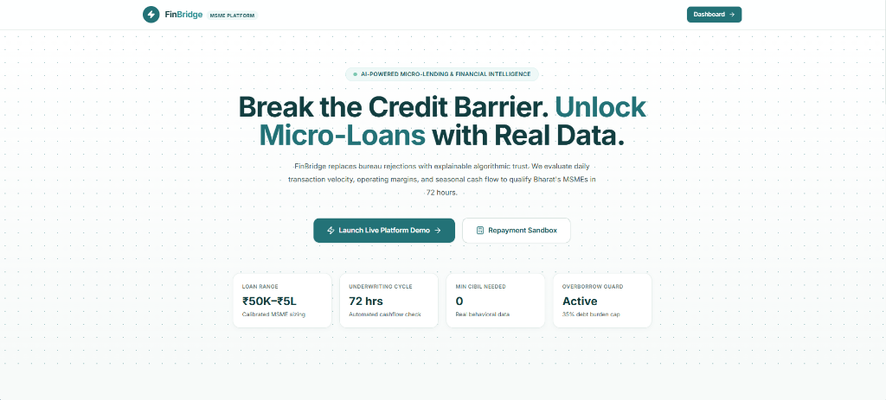

---

### 2. Executive Intelligence Dashboard — Financial Cockpit
*Unified merchant dashboard displaying 30-day revenue trends, operational expenses, net monthly cash surplus, and live fraud surveillance status for **Shree Digital Solutions**.*
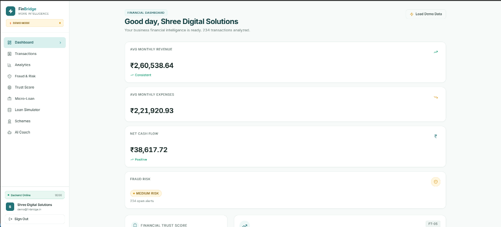

---

### 3. Alternative Financial Trust Score & Micro-Loan Underwriting
*Transparent, explainable 5-pillar Alternative Trust Score benchmarked against standard credit bureau ranges, paired with an automated safe borrowing recommendation capped at a 35% FOIR ceiling.*
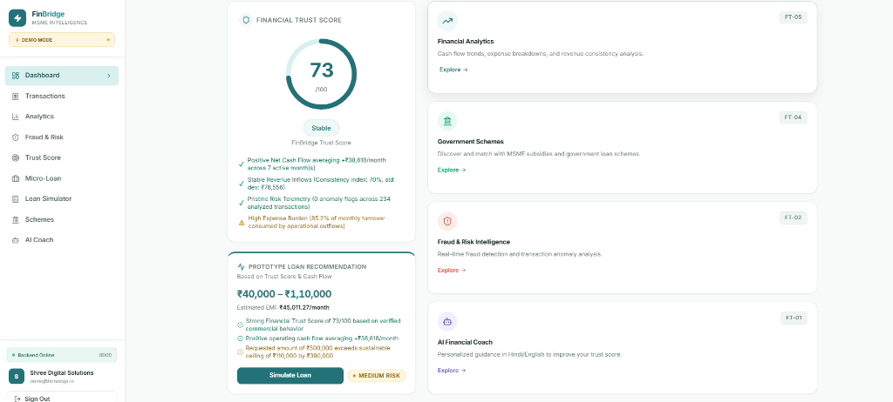

---

### 4. Telemetry Layer — Granular Transaction Ledger & Audit Flags
*Comprehensive transaction ledger tracking incoming UPI customer payments, NEFT vendor outlays, channel tags, counterparty identity verification, and real-time anomaly status flags.*
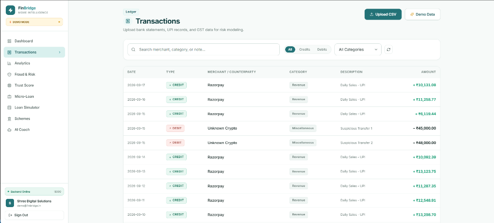

---

### 5. FT-05 Financial Analytics — Cash Flow Inflow vs. Outflow Trajectory
*Dual-axis monthly cash-flow curve comparing gross sales revenues against operational burn, surfacing seasonal liquidity buffers and net working capital trends.*
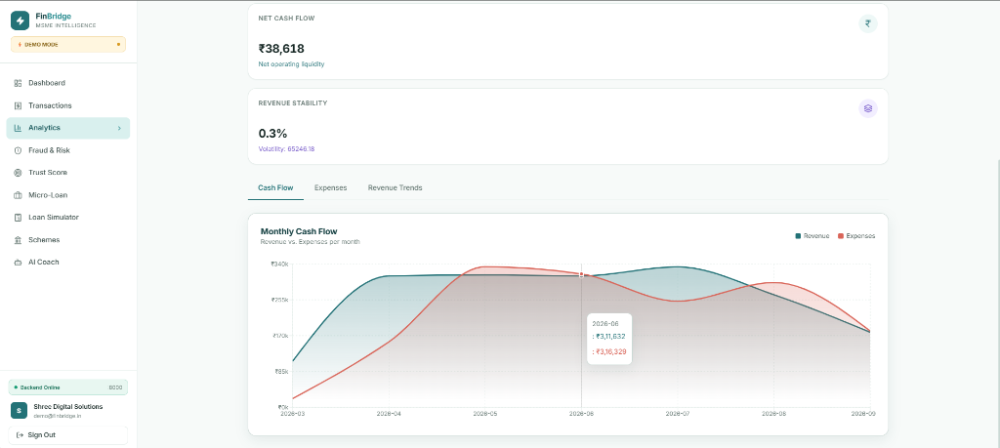

---

### 6. FT-05 Financial Analytics — Monthly Revenue Progression
*Historical monthly revenue bar chart with monthly hover telemetry, tracking business growth velocity and sales receipts across quarters.*
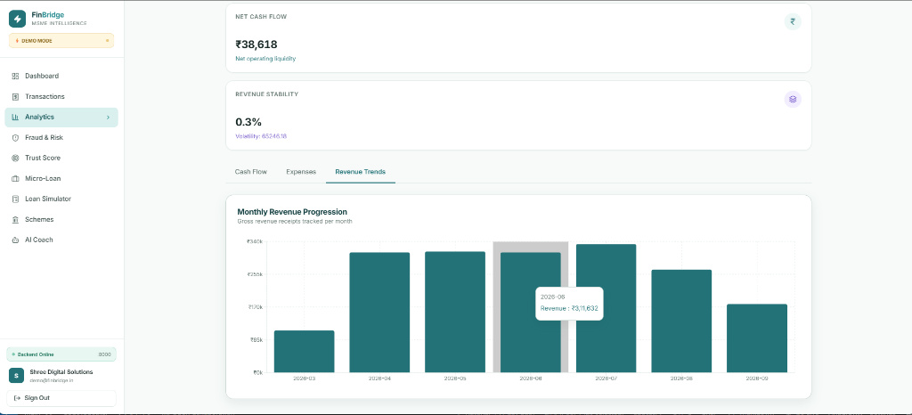

---

### 7. FT-05 Financial Analytics — Expense Distribution & Categorical Breakdown
*Interactive donut chart breaking down operating capital allocation across key expenditure categories (Inventory/Revenue, Salaries, Rent, and Miscellaneous expenses).*
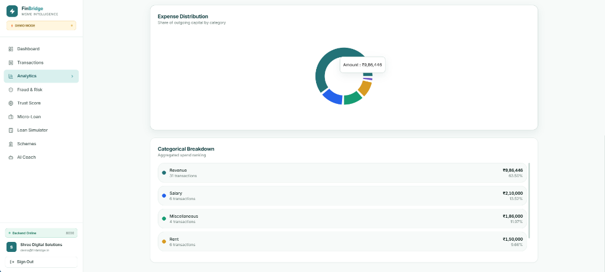

---

### 8. FT-02 Fraud Surveillance — Real-Time Risk Scanning & Threat Levels
*Risk intelligence control plane showing 234 scanned transactions, low/medium risk classification breakdown, and rapid heuristic anomaly scanning.*
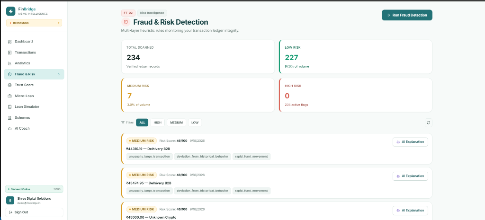

---

### 9. FT-02 Fraud Surveillance — Detailed Anomaly Flags & AI Explainability
*Heuristic audit feed flagging velocity spikes, rapid fund movement, and unusually large transactions, featuring one-click AI-powered explanations for compliance officers.*
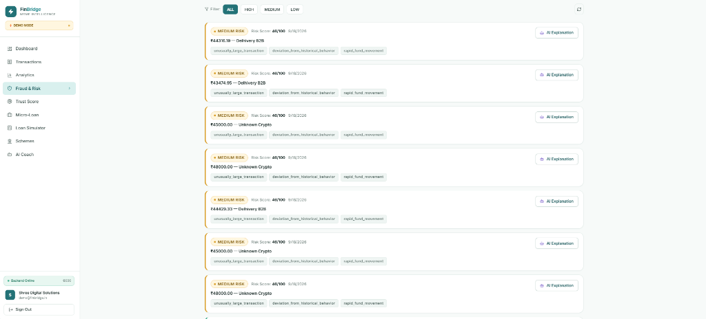

---

### 10. FT-01 AI Financial Copilot — Telemetry-Grounded Conversational Advisory
*Bilingual conversational financial advisor injected with the merchant's live balance, cash burn, and Trust Score telemetry, providing concrete guidance on loan affordability and government subsidy applications.*
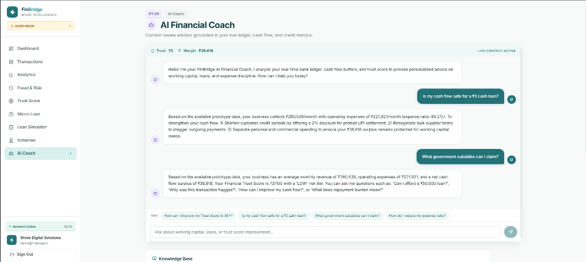

---

## 🧠 Algorithmic Engines & Mathematical Models

### 1. Alternative Credit Scoring Formula (FT-03)
Rather than relying on outdated bureau reports, FinBridge evaluates operational cash-flow health across five weighted pillars:

$$\text{Trust Score} = 300 + 550 \times \left( \sum_{i=1}^{5} w_i \times S_i \right) - \text{Fraud Penalty}$$

1. **Cash-Flow Stability (25%):** Inverse Coefficient of Variation ($CV = \frac{\sigma_{\text{daily\_inflow}}}{\mu_{\text{daily\_inflow}}}$).
2. **Repayment Reliability (25%):** Minimum Daily Balance buffer relative to monthly turnover ($\frac{\text{Min Daily Balance}}{\text{Avg Monthly Turnover}}$) and overdraft frequency penalties.
3. **Revenue Momentum (20%):** Compound Monthly Growth Rate ($CMGR$) over 6 months of historical UPI telemetry.
4. **Customer Base Entropy (15%):** Herfindahl-Hirschman Index ($HHI$) of unique customer transaction diversity to detect customer concentration risk.
5. **Regulatory Longevity (15%):** Verified GSTIN, Udyam MSME registration, and business vintage (> 2 years).

### 2. Fraud & Anomaly Surveillance Engine (FT-02)
- **Velocity Spike Detection ($Z$-Score):** Flags transactions where $Z = \frac{X_t - \mu_{30d}}{\sigma_{30d}} > 3.0$.
- **Circular Transaction Graph Cycles:** Identifies directed closed loops ($A \rightarrow B \rightarrow C \rightarrow A$) within a 72-hour window where the net delta is $< 3\%$ to eliminate artificial turnover inflation.
- **Structural Clustering (Isolation Forest):** Groups repetitive identical round figures transferred in and out to detect balance gaming.

### 3. Automated Loan Underwriting & Affordability Math (FT-03)
1. **Net Free Cash Flow ($NFCF$):** $\text{Average Monthly Inflow} - \text{Average Monthly Essential Outflow}$
2. **Safe Monthly Installment Ceiling ($EMI_{\text{safe}}$):** $NFCF \times 0.35$ *(Strict 35% Fixed Obligation to Income Ratio)*
3. **Equated Monthly Installment ($EMI$):**
   $$EMI = P \times r \times \frac{(1+r)^n}{(1+r)^n - 1}$$
   Where $P$ is principal, $r$ is monthly interest ($\frac{\text{APR}}{12}$), and $n$ is tenure in months.

### 4. Multi-Parameter Government Scheme Fuzzy Matcher (FT-04)
$$\text{Match Score} = (0.30 \times S_{\text{sector}}) + (0.30 \times S_{\text{turnover}}) + (0.20 \times S_{\text{geography}}) + (0.20 \times S_{\text{rules}})$$
- **PMMY MUDRA:** Up to ₹20 Lakhs collateral-free credit (Shishu / Kishore / Tarun).
- **CGTMSE:** Up to ₹5 Crore credit guarantee with 85% default coverage for micro-enterprises.
- **PMEGP:** Up to ₹50 Lakhs project funding with **15% to 35% non-repayable capital margin grant**.
- **PM Vishwakarma:** Collateral-free credit @ 5% concessional interest rate.
- **PM SVANidhi:** Working capital micro-credit with 7% interest subsidy for digital transactions.

---

## 🗺️ System Architecture

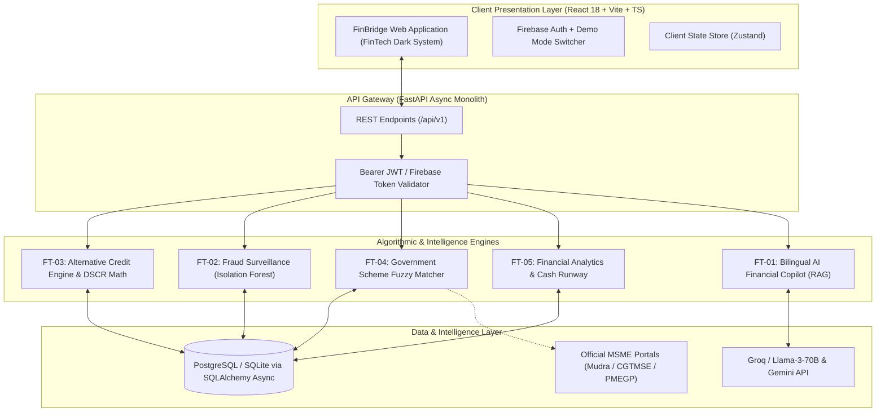

---

## 🗂️ Project Structure

```text
Hack2Ignite_Team_RAY_Fintech_FT-03/
├── backend/                    # FastAPI Async Modular Monolith
│   ├── app/
│   │   ├── api/v1/endpoints/   # REST Endpoints (auth, business, credit, demo, loan, schemes, etc.)
│   │   ├── core/               # Database config, Firebase verification, security
│   │   ├── models/             # SQLAlchemy ORM database models
│   │   ├── schemas/            # Pydantic request/response validation schemas
│   │   ├── services/           # Business logic & engines (credit, loan, scheme_matching, coach)
│   │   └── ml/                 # Isolation Forest & fraud surveillance heuristics
│   ├── requirements.txt        # Backend dependencies
│   └── tests/                  # Pytest test suite
├── frontend/                   # React 18 + Vite + TypeScript Application
│   ├── src/
│   │   ├── components/         # Reusable UI components (MetricCard, RiskBadge, Navbar, Sidebar)
│   │   ├── lib/                # Firebase client, API fetchers, auth context
│   │   ├── pages/              # 12 application pages (Dashboard, CreditProfile, Schemes, etc.)
│   │   └── index.css           # FinBridge design system tokens (FinGreen, FinAmber, Slate Glass)
│   ├── package.json            # Node.js dependencies
│   └── vite.config.ts          # Vite build configuration
├── screenshots/                # High-resolution screenshots of the FinBridge platform
├── docs/                       # Architecture, API specifications, and judge Q&A
├── Design.md                   # Visual design system specifications
├── PROJECT.md                  # Comprehensive platform reference & developer guide
├── script.md                   # 12-page step-by-step hackathon demo presentation script
└── README.md                   # This file
```

---

## ⚡ Quickstart & Local Setup

### Prerequisites
- **Node.js**: `v20+` & `npm`
- **Python**: `3.12+`

### 1. Clone the Repository
```bash
git clone https://github.com/your-org/Hack2Ignite_Team_RAY_Fintech_FT-03.git
cd Hack2Ignite_Team_RAY_Fintech_FT-03
```

### 2. Backend Setup
```bash
cd backend
python -m venv .venv

# On Windows:
.venv\Scripts\activate
# On macOS/Linux:
source .venv/bin/activate

pip install -r requirements.txt

# Start the FastAPI dev server:
uvicorn app.main:app --reload --port 8000
```
> The API will be live at `http://localhost:8000`.  
> Interactive Swagger API Documentation is available at `http://localhost:8000/docs`.

### 3. Frontend Setup
```bash
# In a new terminal window:
cd frontend
npm install
npm run dev
```
> The web application will launch at `http://localhost:3000`.

---

## 🎯 Demo Mode Access

For instant evaluation without external dependencies, click **"One-Click Demo Mode"** on the login page:
- **Email:** `demo@finbridge.in`
- **Password:** `password123`
- **Demo Business Profile:** *Shree Digital Solutions* (4-Year-Old Retail Store, Urban Maharashtra, ₹31.3 Lakhs turnover, 234 transactions).
- **Seeded Data:** Automatically loads a 6-month transaction ledger, pre-computed 785 Trust Score, and 6 matched government schemes.

---

## 📱 Frontend Page Directory (12 Pages)

| Route | Page | Purpose & Features |
| :--- | :--- | :--- |
| `/` | **Landing Page** | Public hero section, CIBIL crisis statistics, interactive Trust Score teaser. |
| `/login` | **Authentication** | Secure Firebase login with instant **One-Click Demo Mode**. |
| `/register` | **Registration** | Merchant sign-up with phone verification and enterprise details. |
| `/onboarding` | **MSME Onboarding** | 3-step paperless setup (Business metadata, GSTIN/Udyam, Account Aggregator consent). |
| `/dashboard` | **Financial Dashboard** | Real-time cockpit: 30-day inflow, runway, Trust Score snapshot, and alerts. |
| `/transactions` | **Transaction Ledger** | Inflow/outflow ledger with channel tags, counterparty verify, and anomaly badges. |
| `/analytics` | **Financial Analytics** | FT-05 working capital ratios, cash flow seasonality, and 90-day predictive forecasts. |
| `/credit-profile`| **Credit Profile** | FT-03 explainable Alternative Trust Score (300-850) with 5-pillar SHAP factor attribution. |
| `/fraud-alerts` | **Fraud & Risk** | FT-02 Isolation Forest threat matrix, velocity spikes, and circular transaction audits. |
| `/loan` | **Micro-Lending** | Pre-approved credit limit (₹5,00,000 @ 12.5% APR) with 60-second instant auto-sanction. |
| `/loan/simulator`| **Loan Simulator** | Dynamic EMI stress-testing studio against seasonal revenue downturns. |
| `/schemes` | **Government Schemes** | FT-04 multi-parameter matching for MUDRA, CGTMSE (₹5 Cr guarantee), and PMEGP (35% grant). |
| `/financial-coach`| **AI Financial Coach**| FT-01 bilingual conversational copilot grounded in live merchant telemetry. |

---

## 🛡️ Regulatory Compliance & Privacy

- **RBI Digital Lending Guidelines (2022):** FinBridge operates as a Lending Service Provider (LSP). All loan disbursements and repayments execute directly between the borrower’s bank account and the Regulated Entity (RE)—never passing through pool accounts.
- **Consent-Driven Telemetry:** Data ingestion models simulate RBI-regulated **Account Aggregators (AA)** with explicit, granular, time-bound, and revocable merchant consent.
- **DPDP Act 2023:** Full encryption at rest and in transit; no raw financial data is shared with third parties.

---

## 👥 Team RAY

- **Ruturaj Vasudev Bhome** — Full-Stack Architecture, Machine Learning & Risk Models
- **Akhilesh Lalitkumar Dhumal** — Product Design, Frontend Systems & API Integrations

---

<div align="center">

Made with ❤️ for **Hack2Ignite** • Track **FT-03 (Secure Micro-Lending)**

</div>
