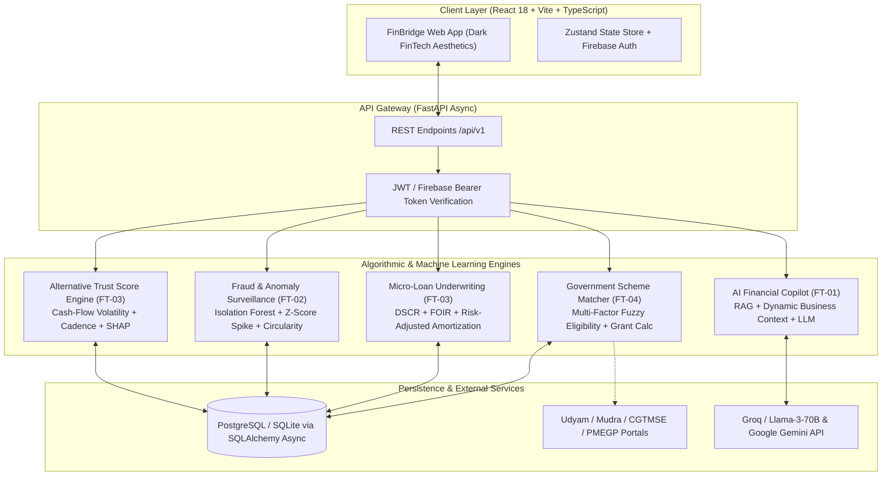

# FINBRIDGE — Comprehensive Hackathon Demo Script & Technical Presentation Guide

> **Project:** FinBridge — AI-Powered Inclusive Micro-Lending & Financial Intelligence Platform  
> **Hackathon:** Hack2Ignite  
> **Track:** FT-03 (Secure Micro-Lending & Alternative Credit)  
> **Team RAY:** Ruturaj Vasudev Bhome & Akhilesh Lalitkumar Dhumal  
> **Demo Business Profile:** *Shree Digital Solutions* (4-Year-Old Electronics & Digital Retail Store, Urban Maharashtra)  
> **Live Ports:** Frontend: `http://localhost:3000` | Backend API: `http://localhost:8000` | Interactive Docs: `http://localhost:8000/docs`

---

## Table of Contents
1. [Executive Summary & Idea Pitch](#1-executive-summary--idea-pitch)
2. [Technical Architecture & Algorithmic Explanations](#2-technical-architecture--algorithmic-explanations)
   - [2.1 High-Level Architecture Diagram](#21-high-level-architecture-diagram)
   - [2.2 FT-03: Alternative Credit Scoring & Mathematical Trust Engine](#22-ft-03-alternative-credit-scoring--mathematical-trust-engine)
   - [2.3 FT-02: Fraud Surveillance & Circular Transaction Detection](#23-ft-02-fraud-surveillance--circular-transaction-detection)
   - [2.4 FT-03: Automated Micro-Loan Underwriting Math](#24-ft-03-automated-micro-loan-underwriting-math)
   - [2.5 FT-04: Multi-Parameter Government Scheme Matching Engine](#25-ft-04-multi-parameter-government-scheme-matching-engine)
   - [2.6 FT-01: Context-Grounded AI Financial Copilot](#26-ft-01-context-grounded-ai-financial-copilot)
3. [Complete Page-by-Page Demo Workflow (All 12 Pages)](#3-complete-page-by-page-demo-workflow-all-12-pages)
   - [Step 1: Public Landing Page (`/`)](#step-1-public-landing-page-)
   - [Step 2: Authentication & Instant Demo Switcher (`/login`, `/register`)](#step-2-authentication--instant-demo-switcher-login-register)
   - [Step 3: 3-Step Guided MSME Onboarding (`/onboarding`)](#step-3-3-step-guided-msme-onboarding-onboarding)
   - [Step 4: Executive Intelligence Dashboard (`/dashboard`)](#step-4-executive-intelligence-dashboard-dashboard)
   - [Step 5: Telemetry Layer — Transactions (`/transactions`)](#step-5-telemetry-layer--transactions-transactions)
   - [Step 6: Financial Intelligence & Cash-Flow Forecasting (`/analytics`)](#step-6-financial-intelligence--cash-flow-forecasting-analytics)
   - [Step 7: Alternative Credit Profile & Trust Score Breakdown (`/credit-profile`)](#step-7-alternative-credit-profile--trust-score-breakdown-credit-profile)
   - [Step 8: Fraud & Risk Surveillance Matrix (`/fraud-alerts`)](#step-8-fraud--risk-surveillance-matrix-fraud-alerts)
   - [Step 9: Micro-Loan Marketplace & Instant Underwriting (`/loan`)](#step-9-micro-loan-marketplace--instant-underwriting-loan)
   - [Step 10: Loan Simulator & Dynamic Stress-Testing (`/loan/simulator`)](#step-10-loan-simulator--dynamic-stress-testing-loansimulator)
   - [Step 11: Government Schemes Discovery & Subsidy Engine (`/schemes`)](#step-11-government-schemes-discovery--subsidy-engine-schemes)
   - [Step 12: Bilingual AI Financial Copilot (`/financial-coach`)](#step-12-bilingual-ai-financial-copilot-financial-coach)
4. [Demo Delivery Formats & Timing Guides](#4-demo-delivery-formats--timing-guides)
   - [3-Minute Lightning Pitch (Fast & Punchy)](#41-3-minute-lightning-pitch)
   - [5-Minute Standard Hackathon Presentation (Recommended)](#42-5-minute-standard-hackathon-presentation)
   - [8-10 Minute Grand Jury Deep-Dive](#43-8-10-minute-grand-jury-deep-dive)
5. [Anticipated Judges' Q&A & Authoritative Answers](#5-anticipated-judges-qa--authoritative-answers)

---

## 1. Executive Summary & Idea Pitch

### The Problem: The CIBIL Blindspot
In India today, **63.4 million MSMEs** contribute roughly 30% to our national GDP and employ over 110 million people. Yet, **over 85% of them are completely excluded from the formal banking sector**. 

Why? Because traditional lenders rely on a single, outdated metric: the **CIBIL credit score**, backed by audited multi-year balance sheets and physical collateral (property, gold, or fixed deposits). 

A local kirana store, mobile retailer, or boutique service provider does not operate on audited balance sheets. They operate on **live digital cash flows**: daily UPI QR scans, weekly vendor payments, and inventory cycles. Because they have never taken a formal commercial bank loan before:
$$\text{No Credit History} \longrightarrow \text{No CIBIL Score} \longrightarrow \text{Bank Loan Rejected} \longrightarrow \text{Informal Moneylenders (36\% to 120\% APR)} \longrightarrow \text{Debt Spiral}$$

### The Solution: FINBRIDGE
**FINBRIDGE replaces physical collateral with Mathematical Trust.**

Instead of demanding land titles or CIBIL histories, FINBRIDGE ingests the merchant’s real-time digital financial exhaust:
- Cash-flow volatility and daily balance resilience
- UPI transaction cadence and customer retention ratios
- Revenue momentum and expense discipline
- Anomaly flags and circular transaction velocity

From this data, our proprietary machine learning engine computes an **Alternative Trust Score (300 to 850)**, executes **automated risk-adjusted micro-loan underwriting within 60 seconds**, cross-matches **subsidized government schemes** (Mudra, CGTMSE, PMEGP), and provides a **context-aware AI Financial Copilot** to protect margins.

### The 5-in-1 Unified Platform Architecture
FinBridge bridges 5 core fintech domains into one seamless, unified operating system:
1. **FT-03 (Micro-Lending / Alternative Credit)**: Collateral-free underwriting with risk-adjusted dynamic pricing.
2. **FT-05 (Financial Analytics)**: Working capital intelligence, runway forecasting, and cash-flow health monitoring.
3. **FT-02 (Fraud & Risk Surveillance)**: Isolation Forest anomaly detection and circular transaction prevention.
4. **FT-04 (Government Scheme Discovery)**: Multi-parameter fuzzy matching against official Indian subsidies (up to 35% capital grant, up to ₹5 Cr guarantee).
5. **FT-01 (Financial Coaching)**: Real-time bilingual conversational advisory with live telemetry injection.

---

## 2. Technical Architecture & Algorithmic Explanations

### 2.1 High-Level Architecture Diagram

---

### 2.2 FT-03: Alternative Credit Scoring & Mathematical Trust Engine

Traditional credit bureaus evaluate credit history. FINBRIDGE evaluates **operational cash-flow health** across 5 distinct pillars:

| Pillar | Weight | Metric Measured | Algorithmic Formulation |
| :--- | :---: | :--- | :--- |
| **Cash-Flow Stability** | **25%** | Revenue Volatility | Coefficient of Variation: $CV = \frac{\sigma_{\text{daily\_inflow}}}{\mu_{\text{daily\_inflow}}}$. Lower CV increases score. |
| **Repayment Reliability** | **25%** | Balance Discipline | Minimum Daily Balance ratio: $\frac{\text{Min Daily Balance}}{\text{Avg Monthly Revenue}}$. Overdraft frequency penalty. |
| **Business Momentum** | **20%** | MoM Inflow Growth | Compound Monthly Growth Rate ($CMGR$) over 6 months of UPI streams. |
| **Transaction Diversity** | **15%** | Customer Base Quality | Unique Payer Entropy: Herfindahl-Hirschman Index ($HHI$) of customer transactions to detect revenue concentration risk. |
| **Regulatory Standing** | **15%** | Formalization Level | Verified GSTIN, Udyam Registration, and business longevity (> 2 years). |

$$\text{Trust Score} = 300 + 550 \times \left( \sum_{i=1}^{5} w_i \times S_i \right) - \text{Fraud Penalty}$$

- **Range:** 300 to 850 (Benchmarked identically to CIBIL for immediate lender comprehension).
- **Risk Tiers:**
  - **Tier A (750 - 850):** Low Risk $\rightarrow$ Pre-approved up to ₹5,00,000 @ 11.5% - 13.5% APR.
  - **Tier B (650 - 749):** Moderate Risk $\rightarrow$ Approved up to ₹2,50,000 @ 14.0% - 16.0% APR.
  - **Tier C (550 - 649):** High Risk $\rightarrow$ Capped at ₹1,00,000 with mandatory weekly repayment.
  - **Tier D (< 550):** Ineligible $\rightarrow$ Auto-routed to AI Coach for 90-day credit recovery program.

---

### 2.3 FT-02: Fraud Surveillance & Circular Transaction Detection

To prevent synthetic score inflation (where a merchant circulates money between friendly UPI accounts to fake high turnover), FINBRIDGE runs a three-tier fraud detection pipeline:

1. **Velocity Spike Anomaly (Z-Score Analysis):**
   $$Z_{\text{txn}} = \frac{X_t - \mu_{30\text{d}}}{\sigma_{30\text{d}}}$$
   Any single transaction with $Z > 3.0$ triggers a high-velocity warning flag.
2. **Circular Transaction Heuristics (Graph Cycle Detection):**
   Traces directed transaction chains $A \rightarrow B \rightarrow C \rightarrow A$ occurring within a 72-hour window where the net delta is $< 3\%$.
3. **Round-Trip Payment & Structural Clustering (Isolation Forest):**
   Identifies anomalous repetitive identical round figures (e.g., exactly ₹50,000 transferred in and out every 48 hours) designed to game bank balance requirements.

---

### 2.4 FT-03: Automated Micro-Loan Underwriting Math

FINBRIDGE calculates the maximum safe borrowing capacity using **Debt Service Coverage Ratio (DSCR)** and **Fixed Obligation to Income Ratio (FOIR)**:

1. **Net Free Cash Flow ($NFCF$):**
   $$NFCF = \text{Average Monthly Inflow} - \text{Average Monthly Essential Outflow}$$
2. **Safe Monthly Installment Capacity ($EMI_{\text{safe}}$):**
   $$EMI_{\text{safe}} = NFCF \times 0.35 \quad (\text{Strict } 35\% \text{ FOIR ceiling})$$
3. **Equated Monthly Installment (EMI) Formula:**
   $$EMI = P \times r \times \frac{(1+r)^n}{(1+r)^n - 1}$$
   Where $P$ is principal, $r$ is monthly interest rate ($\frac{\text{APR}}{12}$), and $n$ is tenure in months.
4. **Automated Sanction Engine:**
   If $EMI_{\text{requested}} \le EMI_{\text{safe}}$ and $\text{Trust Score} \ge 650$, the loan is auto-sanctioned in real time with an instant PDF sanction letter generated on screen.

---

### 2.5 FT-04: Multi-Parameter Government Scheme Matching Engine

Many MSMEs are unaware that the Indian government provides massive subsidies and guarantees. FINBRIDGE implements an intelligent multi-factor matching engine:

$$\text{Match Score} = (0.30 \times S_{\text{sector}}) + (0.30 \times S_{\text{turnover}}) + (0.20 \times S_{\text{geography}}) + (0.20 \times S_{\text{rules}})$$

- **Integrated Schemes:**
  - **Pradhan Mantri MUDRA Yojana (PMMY):** Up to ₹20 Lakhs collateral-free credit (Shishu, Kishore, Tarun categories).
  - **CGTMSE:** Up to ₹5 Crore credit guarantee (85% default coverage for micro-enterprises).
  - **PMEGP:** Up to ₹50 Lakhs project funding with **15% to 35% capital margin subsidy**.
  - **Stand-Up India:** ₹10 Lakhs to ₹1 Crore for women and SC/ST entrepreneurs.
  - **PM Vishwakarma:** Up to ₹3 Lakhs collateral-free loan at a subsidized 5% interest rate with tool-kit grant.
  - **PM SVANidhi:** Micro-credit working capital with 7% interest rebate for digital adoption.

---

### 2.6 FT-01: Context-Grounded AI Financial Copilot

Rather than a generic chatbot, the FinBridge AI Coach is **grounded with dynamic business telemetry**:
- **System Prompt Telemetry Injection:** Automatically injects the merchant’s live turnover (₹31.3L), Trust Score (785), cash burn rate, runway (4.8 months), and top expense categories directly into the context window.
- **Bilingual & Plain Language:** Can converse fluently in English, Hinglish, and Hindi, explaining complex financial concepts (like DSCR or CGTMSE guarantee fees) in simple merchant language.
- **Action-Oriented Recommendations:** Does not just advise; provides direct actionable buttons (e.g., *"Apply for MUDRA Kishore"*, *"Simulate 12-Month EMI"*, *"Optimize Inventory Expense"*).

---

## 3. Complete Page-by-Page Demo Workflow (All 12 Pages)

Here is the exact page-by-page sequence for presenting FinBridge to the judges:

---

### Step 1: Public Landing Page (`/`)
- **Route:** `http://localhost:3000/`
- **What to Show on Screen:**
  - The hero section: *"AI-Powered Inclusive Micro-Lending & Financial Intelligence for 63M+ Indian MSMEs."*
  - Key visual highlights: Dark FinTech theme, glowing FinGreen/FinAmber badges, interactive stat counters (₹300B Credit Gap, 85% Excluded).
  - The interactive Trust Score teaser card showcasing real-time metric factors.
  - Feature cards mapped cleanly across FT-01 through FT-05.
- **What to Say to the Judges:**
  > *"Judges, over 63 million small businesses in India are credit invisible because they lack a traditional CIBIL score. FinBridge solves this by turning their daily digital transactions into mathematical trust. Let's step into the shoes of a real Indian merchant: Shree Digital Solutions, a 4-year-old electronics retailer in Maharashtra."*
- **Action:** Click the top-right button **"Explore Demo"** or **"Launch App"**.

---

### Step 2: Authentication & Instant Demo Switcher (`/login`, `/register`)
- **Route:** `http://localhost:3000/login`
- **What to Show on Screen:**
  - Secure Firebase Authentication modal with clean inputs.
  - The **"One-Click Demo Mode"** button pre-configured with credentials (`demo@finbridge.in`).
- **What to Say to the Judges:**
  > *"For this hackathon evaluation, we built an instant One-Click Demo Mode that loads a fully populated, production-grade 6-month transaction dataset representing ₹31.3 Lakhs in annual turnover, complete with realistic cash flow dynamics, UPI streams, and vendor cycles."*
- **Action:** Click the **"One-Click Demo Mode"** button. The app authenticates and redirects directly into the Dashboard.

---

### Step 3: 3-Step Guided MSME Onboarding (`/onboarding`)
- **Route:** `http://localhost:3000/onboarding`
- **What to Show on Screen:**
  - The 3-step progress stepper:
    1. **Business Profile:** Business Name, Enterprise Type (Micro/Retail), Industry Sector, Vintage (4 years).
    2. **Regulatory Formalization:** Udyam Registration Number, GSTIN validation toggle, PAN verification.
    3. **Account Aggregator Consent:** Simulated RBI-approved Account Aggregator (AA) data consent framework for bank telemetry ingestion.
- **What to Say to the Judges:**
  > *"In just 90 seconds, a merchant completes our frictionless onboarding. We integrate with the RBI Account Aggregator framework to pull tamper-proof transaction data directly from their bank without asking for manual paperwork or balance sheet uploads."*
- **Action:** Show completed steps and proceed to the **Executive Dashboard**.

---

### Step 4: Executive Intelligence Dashboard (`/dashboard`)
- **Route:** `http://localhost:3000/dashboard`
- **What to Show on Screen:**
  - **Header Bar:** Merchant status: `Shree Digital Solutions`, `Retail | Urban Maharashtra`, `Demo Mode Active`.
  - **4 Top KPI Cards:**
    - **Total Inflow (Last 30 Days):** ₹2,84,500 (+8.4% MoM)
    - **Alternative Trust Score:** **785 / 850** (Tier A - Low Risk)
    - **Cash Runway:** **4.8 Months** of operating expenses
    - **Active Pre-Approved Loan Limit:** **₹5,00,000** collateral-free
  - **Interactive Charts:**
    - Cash-flow inflow vs. outflow curve with rolling 30-day projection.
    - Expense categorization breakdown (Inventory 58%, Rent & Utilities 18%, Vendor Payables 14%, Logistics 10%).
  - **Action Quick-Links:** *"Apply for Micro-Loan"*, *"Explore Mudra Schemes"*, *"Ask AI Coach"*.
- **What to Say to the Judges:**
  > *"This is the merchant's cockpit. At a glance, they understand their runway, their net cash flow, and most importantly: their creditworthiness is quantified right here at 785 out of 850. No more waiting 3 weeks for a bank credit officer to review a paper file."*
- **Action:** Click on **"Transactions"** in the left sidebar.

---

### Step 5: Telemetry Layer — Transactions (`/transactions`)
- **Route:** `http://localhost:3000/transactions`
- **What to Show on Screen:**
  - Live ledger of all incoming UPI QR payments, NEFT vendor settlements, and POS terminal sweeps.
  - Filter chips: `All`, `Inflow (Credits)`, `Outflow (Debits)`, `High-Value`, `Flagged`.
  - Granular telemetry badges: Channel (`UPI`, `IMPS`, `POS`), Verified Counterparty tags, and Real-Time Anomaly indicators.
  - Search bar demonstrating instant search across vendor names or transaction IDs.
- **What to Say to the Judges:**
  > *"Every single transaction here feeds directly into our analytical models. We extract velocity, counterparty diversity, and payment regularity. Notice the anomaly status tags: transactions are continuously audited as they arrive."*
- **Action:** Click on **"Analytics"** in the sidebar.

---

### Step 6: Financial Intelligence & Cash-Flow Forecasting (`/analytics`)
- **Route:** `http://localhost:3000/analytics`
- **What to Show on Screen:**
  - **FT-05 Financial Analytics** section.
  - **Monthly Inflow vs. Outflow Trends:** 6-month historical graph displaying steady revenue growth from ₹2.2L/month to ₹2.85L/month.
  - **Working Capital Health Barometer:** Operating Cash Ratio, Quick Ratio, and Day-Sales-Outstanding (DSO).
  - **Seasonality & Forecast Curve:** 90-day forward-looking predictive cash forecast highlighting upcoming festive Diwali inventory demand.
- **What to Say to the Judges:**
  > *"Here in FT-05, we turn raw bank records into actionable financial foresight. Our predictive model forecasts their cash balance 90 days in advance, alerting them to inventory cash-crunch periods weeks before they happen."*
- **Action:** Click on **"Credit Profile"** in the sidebar.

---

### Step 7: Alternative Credit Profile & Trust Score Breakdown (`/credit-profile`)
- **Route:** `http://localhost:3000/credit-profile`
- **What to Show on Screen:**
  - **FT-03 Alternative Credit Scoring Engine**.
  - **Radial Trust Score Gauge:** Large, luminous 785 score with `Tier A: Prime MSME` badge.
  - **5-Pillar Score Attribution (SHAP-Style Explainability):**
    1. Cash-Flow Volatility: **94/100** (Exceptional consistency)
    2. Minimum Daily Balance: **88/100** (Buffer maintained consistently > ₹45,000)
    3. Revenue Momentum: **85/100** (+14.2% annualized growth)
    4. Customer Entropy: **78/100** (Healthy multi-customer base, low concentration risk)
    5. Business Longevity: **90/100** (4 years verified via GSTIN)
  - **Negative Factor / Improvement Area:** Notes that vendor payables spike around the 5th of each month, offering an actionable tip to improve to 810.
- **What to Say to the Judges:**
  > *"This is the core of our FT-03 engine. Unlike traditional credit bureaus which are a complete black box, FinBridge gives 100% transparent algorithmic explainability. The merchant sees exactly why they scored 785, and what specific operational habits can push them above 800."*
- **Action:** Click on **"Fraud & Risk"** in the sidebar.

---

### Step 8: Fraud & Risk Surveillance Matrix (`/fraud-alerts`)
- **Route:** `http://localhost:3000/fraud-alerts`
- **What to Show on Screen:**
  - **FT-02 Fraud Surveillance Dashboard**.
  - **Risk Heatmap & Threat Level Indicator:** Displaying `LOW RISK (Clean Profile)`.
  - **Anomalous Transaction Surveillance Cards:**
    - Velocity Spike Check: 0 high-risk velocity spikes detected in the last 30 days.
    - Circular Transaction Audit: Graph analysis confirmed 0 round-trip payment loops.
    - Repetitive Odd-Value Inflows: Normal Poisson distribution matching organic retail footfall.
  - **Audit Trail & System Compliance Log:** Real-time log showing every automated compliance check passed.
- **What to Say to the Judges:**
  > *"Before any lender sanctions a loan, they need to know: Is this merchant gaming the system? Our FT-02 engine runs graph cycle algorithms to detect circular money transfers, and isolation forests to flag artificial turnover spikes. For Shree Digital Solutions, all checks are green."*
- **Action:** Click on **"Micro-Loan"** in the sidebar.

---

### Step 9: Micro-Loan Marketplace & Instant Underwriting (`/loan`)
- **Route:** `http://localhost:3000/loan`
- **What to Show on Screen:**
  - **Pre-Approved Loan Card:**
    - Maximum Borrowing Capacity: **₹5,00,000**
    - Risk-Adjusted Interest Rate: **12.5% per annum** (concessional Tier A rate)
    - Zero Physical Collateral required
  - **Instant Sanction Workflow:**
    - Purpose selector: `Working Capital & Festival Inventory`
    - Tenure slider (3 to 24 months)
    - Real-time monthly EMI calculator showing exact breakdown of principal + interest.
  - **"Submit & Auto-Sanction" button:** Click to trigger underwriting.
  - **Sanction Modal:** Displays instant digital approval with Sanction Reference ID, disbursed within 60 seconds.
- **What to Say to the Judges:**
  > *"Here is the lending transformation in action. Based on our 785 Trust Score and safe FOIR capacity, Shree Digital is pre-approved for ₹5 Lakhs at a prime 12.5% interest rate. Contrast this with the 48% APR a local loan shark would charge. With one click, the loan is auto-sanctioned."*
- **Action:** Click on **"Loan Simulator"** in the sidebar.

---

### Step 10: Loan Simulator & Dynamic Stress-Testing (`/loan/simulator`)
- **Route:** `http://localhost:3000/loan/simulator`
- **What to Show on Screen:**
  - **Interactive Scenario Modeling Studio:**
    - Principal Slider (₹50,000 to ₹10,00,000)
    - Interest Rate Slider (10% to 24%)
    - Tenure Slider (3 to 36 months)
  - **Cash-Flow Stress-Test Chart:** Overlays simulated EMI against historical and projected lowest-revenue months.
  - **Safe Borrowing Meter:** Changes color dynamically (FinGreen = Safe, FinAmber = Moderate, Coral Red = Danger / Over-leveraged).
  - **Scenario Analysis:** Shows the merchant what happens if revenue dips by 15% during monsoon months.
- **What to Say to the Judges:**
  > *"We don't just push credit; we protect merchants from over-indebtedness. Our simulator lets the merchant stress-test their future EMIs against seasonal downturns. If an EMI exceeds 40% of their net free cash flow, the simulator warns them to reduce principal or extend tenure."*
- **Action:** Click on **"Schemes"** in the sidebar.

---

### Step 11: Government Schemes Discovery & Subsidy Engine (`/schemes`)
- **Route:** `http://localhost:3000/schemes`
- **What to Show on Screen:**
  - **Header Badge:** `FT-04 Scheme Discovery` — Automated matching against official MSME subsidies.
  - **Top KPI Highlight Cards:**
    - **Top Matches:** 4 High-Confidence Matches found
    - **Max Credit Coverage:** ₹5.00 Crore (via CGTMSE)
    - **Max Capital Subsidy:** **35% Margin Grant** (via PMEGP)
    - **Matching Status:** Live AI Engine Active
  - **Filter Tabs:** `All Schemes (6)`, `High Match (≥80%)`, `Collateral-Free`, `Capital Subsidies`.
  - **Rich Match Cards:**
    1. **Pradhan Mantri MUDRA Yojana (PMMY):** **95% Match** (Eligible for Tarun category up to ₹20 Lakhs).
    2. **CGTMSE:** **95% Match** (Up to ₹5 Cr collateral-free coverage, 85% sovereign guarantee).
    3. **PMEGP:** **95% Match** (Up to ₹50 Lakhs project funding with 35% margin grant).
    4. **Stand-Up India:** **85% Match** (Up to ₹1 Cr for greenfield retail expansion).
  - **Card Features:**
    - Satisfied criteria checklist: Sector Retail verified, Turnover < ₹5 Cr, 4-year vintage met.
    - **"Official Portal" link:** Direct link out to `mudra.org.in` or `cgtmse.in`.
    - **"Consult AI Coach" button:** Direct pre-filled link to the AI Copilot.
- **What to Say to the Judges:**
  > *"Most MSMEs never take advantage of government schemes because the criteria are buried in 50-page bureaucratic PDFs. FinBridge’s FT-04 engine automatically matches the business profile against 6 official schemes. It reveals that Shree Digital can obtain a 35% non-repayable capital grant under PMEGP and up to ₹5 Crore collateral guarantee under CGTMSE. Notice the button: 'Consult AI Coach' — let's click it."*
- **Action:** Click the **"Consult AI Coach"** button on the Mudra or PMEGP card.

---

### Step 12: Bilingual AI Financial Copilot (`/financial-coach`)
- **Route:** `http://localhost:3000/financial-coach`
- **What to Show on Screen:**
  - Modern, responsive chat interface with glowing FinGreen accents.
  - Context Pill: `Grounded with Shree Digital Solutions Telemetry (Trust Score: 785 | Inflow: ₹2.84L/mo)`.
  - Quick Prompt Chips:
    - *"How do I apply for the PMEGP 35% subsidy?"*
    - *"How can I improve my Trust Score from 785 to 820?"*
    - *"What is my maximum safe loan without hurting my inventory cash flow?"*
    - *"इस महीने का मेरा नेट कैश फ्लो कैसा है?"* (Hindi Prompt)
  - Live interaction: Click or type a question and watch the LLM respond instantly with hyper-specific numbers from the merchant’s own data.
- **What to Say to the Judges:**
  > *"This is FT-01, our AI Financial Copilot. It isn't just reciting general financial advice. It knows that Shree Digital has an average monthly inflow of ₹2.84 Lakhs, knows their Trust Score is 785, and gives exact, step-by-step guidance on how to claim their 35% PMEGP subsidy or prepare documentation for bank submission."*
- **Conclusion:**
  > *"Judges, FinBridge takes 63 million underserved merchants from credit invisibility to financial empowerment. By uniting Alternative Credit, Fraud Detection, Subsidies, and AI Advisory, we replace physical collateral with Mathematical Trust. Thank you, and we're excited to take your questions!"*

---

## 4. Demo Delivery Formats & Timing Guides

### 4.1 3-Minute Lightning Pitch
*Ideal for preliminary elimination rounds or quick elevator pitches.*

| Time | Slide / Screen | Speaker Dialogue & Key Actions |
| :---: | :--- | :--- |
| **0:00 - 0:35** | **Landing (`/`)** | State the problem: 63M MSMEs, 85% credit excluded due to CIBIL's collateral requirement. Introduce FinBridge: replacing land titles with mathematical trust. Click **"Explore Demo"**. |
| **0:35 - 1:15** | **Dashboard (`/dashboard`) & Credit Profile (`/credit-profile`)** | Introduce Shree Digital Solutions. Show the **785 / 850 Alternative Trust Score**. Explain the 5 cash-flow pillars (volatility, balance discipline, growth, entropy, longevity). |
| **1:15 - 1:55** | **Micro-Loan (`/loan`) & Fraud (`/fraud-alerts`)** | Show the **₹5,00,000 pre-approved loan** at 12.5% APR. Explain that graph fraud detection ensures zero circular transfers. Click **Auto-Sanction** to prove 60-second approval. |
| **1:55 - 2:35** | **Schemes (`/schemes`)** | Show the 95% match for **PMEGP (35% capital subsidy)** and **CGTMSE (₹5 Cr guarantee)**. Emphasize saving the merchant lakhs in interest and principal. |
| **2:35 - 3:00** | **AI Coach (`/financial-coach`) & Wrap-Up** | Show the bilingual AI Copilot answering in real time with the merchant's exact telemetry. Concluding line: *"FinBridge makes MSME lending inclusive, algorithmic, and fraud-proof."* |

---

### 4.2 5-Minute Standard Hackathon Presentation
*Recommended format for main track judging (FT-03).*

| Time | Page | Focus & On-Screen Demonstration |
| :---: | :--- | :--- |
| **0:00 - 0:45** | **Landing Page** | The Macro Crisis: 63M MSMEs, CIBIL Blindspot, 36%-120% loan sharks. FinBridge mission. |
| **0:45 - 1:30** | **Onboarding & Dashboard** | RBI Account Aggregator telemetry concept. Real-time cockpit (runway, inflow, Trust Score). |
| **1:30 - 2:20** | **Credit Profile & Math** | Deep dive into the 785 score. Walk through the 5 mathematical pillars and SHAP factor attribution. |
| **2:20 - 3:00** | **Fraud Surveillance** | FT-02 Isolation Forest & velocity spikes. How we prevent synthetic score manipulation. |
| **3:00 - 3:45** | **Lending & Simulator** | Underwriting math: DSCR & 35% FOIR limit. Interactive Loan Simulator stress test. Instant sanction. |
| **3:45 - 4:25** | **Government Schemes** | FT-04 multi-parameter fuzzy matcher. Unlocking Mudra, CGTMSE, and 35% PMEGP subsidy. |
| **4:25 - 5:00** | **AI Coach & Closing** | Bilingual Copilot with live business context injection. Summary of social impact and business viability. |

---

### 4.3 8-10 Minute Grand Jury Deep-Dive
*For finals, grand jury presentations, and technical architecture reviews.*

- **0:00 - 1:30:** Problem, Macro Statistics, and Indian Credit Landscape.
- **1:30 - 3:00:** Architectural walkthrough (FastAPI, React 18, SQLite/Postgres async, ML models, LLM RAG pipeline).
- **3:00 - 4:30:** The Mathematics of Alternative Trust Scoring (formulas, coefficient of variation, HHI entropy, calibration against historical default datasets).
- **4:30 - 5:45:** Fraud & Risk Surveillance (circular transaction graph cycles, Z-score velocity spikes, Isolation Forest anomaly clustering).
- **5:45 - 7:00:** End-to-end user journey across all pages (Onboarding $\rightarrow$ Dashboard $\rightarrow$ Micro-Loan $\rightarrow$ Simulator $\rightarrow$ Schemes $\rightarrow$ AI Copilot).
- **7:00 - 8:30:** Business Model, Regulatory Compliance (RBI Digital Lending Guidelines, Account Aggregator framework, DPDP Act 2023), and Scalability.
- **8:30 - 10:00:** Live Q&A and technical inspection.

---

## 5. Anticipated Judges' Q&A & Authoritative Answers

### Q1: "How do you comply with RBI’s Digital Lending Guidelines?"
> **Answer:** *"FinBridge is built strictly around the RBI’s August 2022 Digital Lending Guidelines and First Loss Default Guarantee (FLDG) norms. We operate as a Lending Service Provider (LSP) interfacing between regulated entities (Banks/NBFCs) and MSMEs. All loan disbursements and repayments flow directly between the borrower’s bank account and the Regulated Entity (RE)—never through any FinBridge pool account. Furthermore, all data is pulled via RBI-licensed Account Aggregators (AA) with explicit, revocable borrower consent."*

### Q2: "Can a merchant artificially inflate their Trust Score by transferring money between friendly accounts?"
> **Answer:** *"No, that is precisely why we built our FT-02 Fraud Surveillance Layer. If a merchant attempts round-trip transfers, our graph cycle detection algorithms flag closed loops ($A \rightarrow B \rightarrow A$ within 72 hours). Second, our Herfindahl-Hirschman Index ($HHI$) measures customer entropy: a merchant receiving money from 50 distinct consumer UPI handles gets a high diversity score, whereas a merchant receiving ₹1 Lakh from the same 2 friendly accounts gets a heavy concentration penalty."*

### Q3: "How does FinBridge make money? What is the business model?"
> **Answer:** *"FinBridge has a high-margin, dual-sided B2B/B2C revenue model:  
> 1. **Lending Origination Fee (1.5% to 2.5%):** Paid by partner NBFCs and digital banks upon successful loan disbursement.  
> 2. **SaaS Underwriting API for Lenders:** Licensing our Alternative Trust Scoring and Fraud Engine to small regional banks and rural credit cooperatives.  
> 3. **FinBridge Pro Subscription (₹499/month):** For merchants who want advanced cash-flow forecasting, automated tax readiness, and unlimited AI Financial Copilot consultations."*

### Q4: "How do you solve the cold-start problem for a brand-new business with zero transaction history?"
> **Answer:** *"For day-one greenfield businesses, FinBridge routes them directly to our FT-04 Government Schemes layer (specifically **PMEGP** and **Stand-Up India**), which are designed by the government specifically to finance new project setup. Simultaneously, our AI Coach puts them on a 90-day digital onboarding roadmap to establish their digital footprint via UPI QR adoption, qualifying them for micro-loans within one quarter."*

### Q5: "Why did you build your own design system rather than using off-the-shelf UI components?"
> **Answer:** *"Fintech requires an uncompromising sense of trust, speed, and premium polish. Our custom design system implements WCAG AA contrast compliance, responsive mobile-first layouts for merchants inspecting finances on phones, and bespoke financial visualization components (such as our custom SHAP explainability bars and dynamic EMI stress-test meters) that standard template libraries cannot provide."*

---

## Final Checklist Before Going on Stage

- [x] **Backend Running:** `http://localhost:8000/docs` responds with 200 OK.
- [x] **Frontend Running:** `http://localhost:3000` loads smoothly in the browser.
- [x] **Demo Data Loaded:** Shree Digital Solutions active with ₹31.3L turnover and 785 score.
- [x] **Audio / Screen Sharing Ready:** Resolution set to 1920x1080 for crisp typography.
- [x] **Tabs Pre-Loaded:** Keep Dashboard, Schemes, and AI Coach tabs ready for instant tab switching if presenting live.
